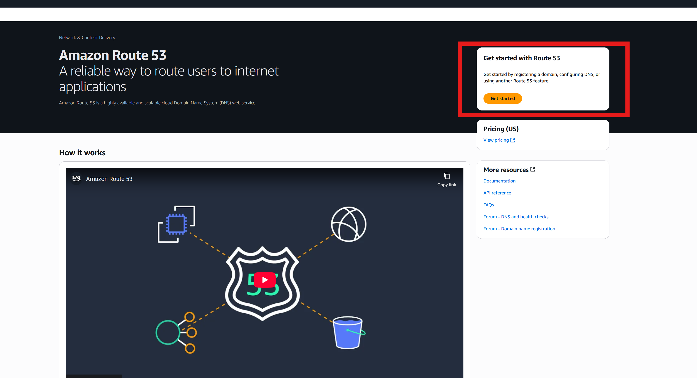
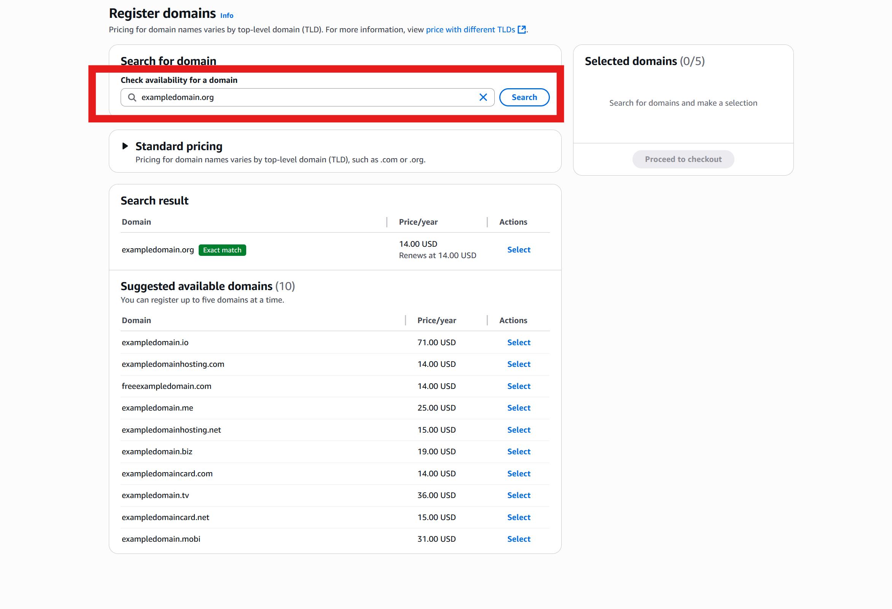
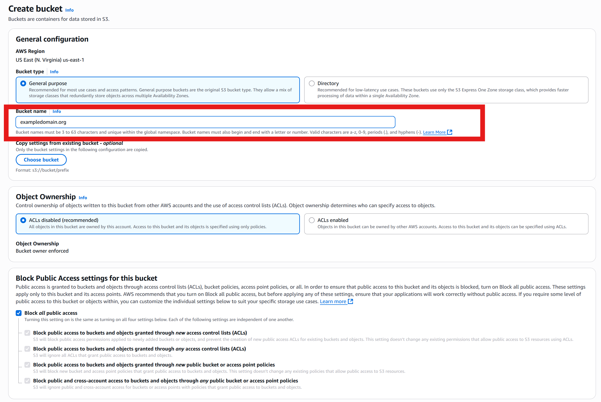
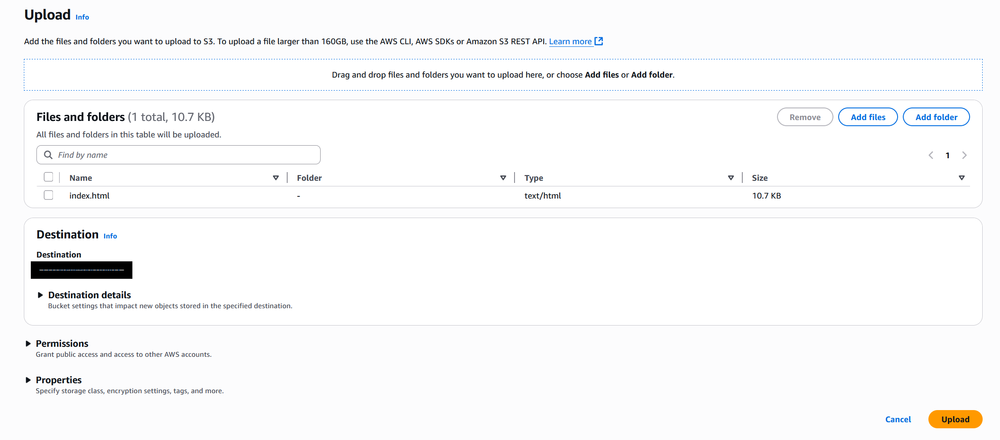
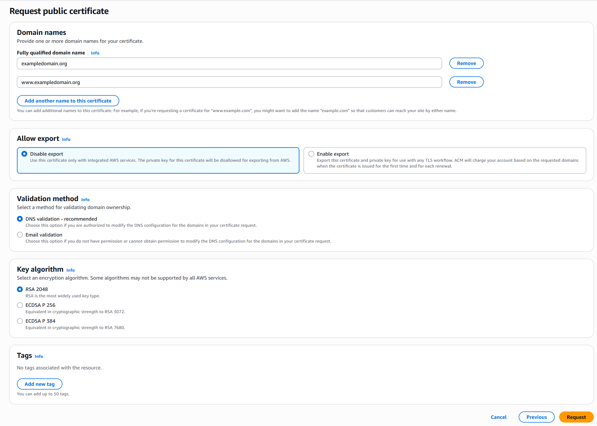
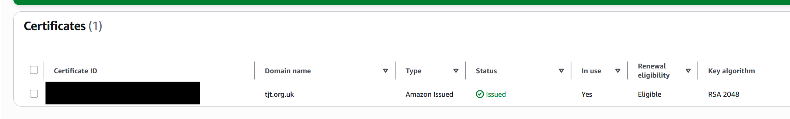
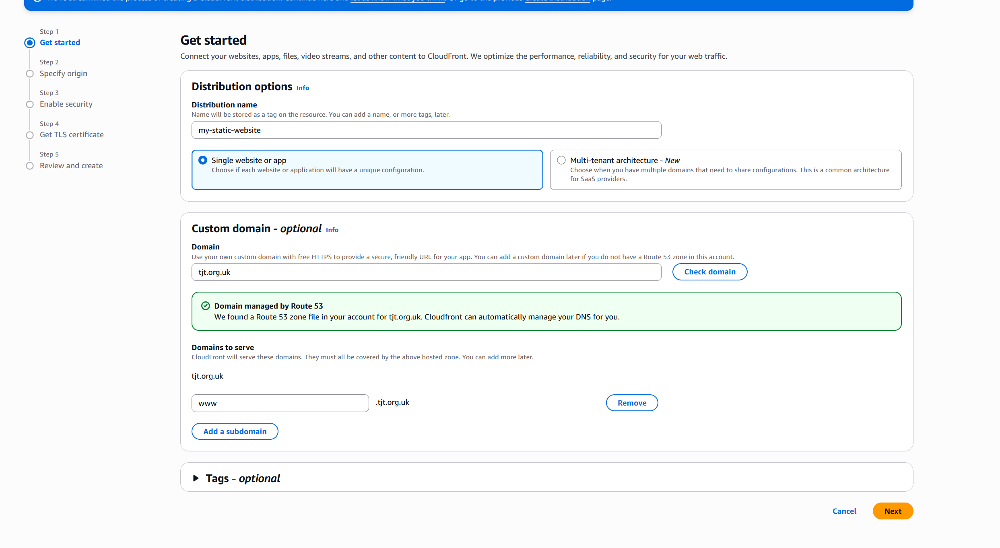
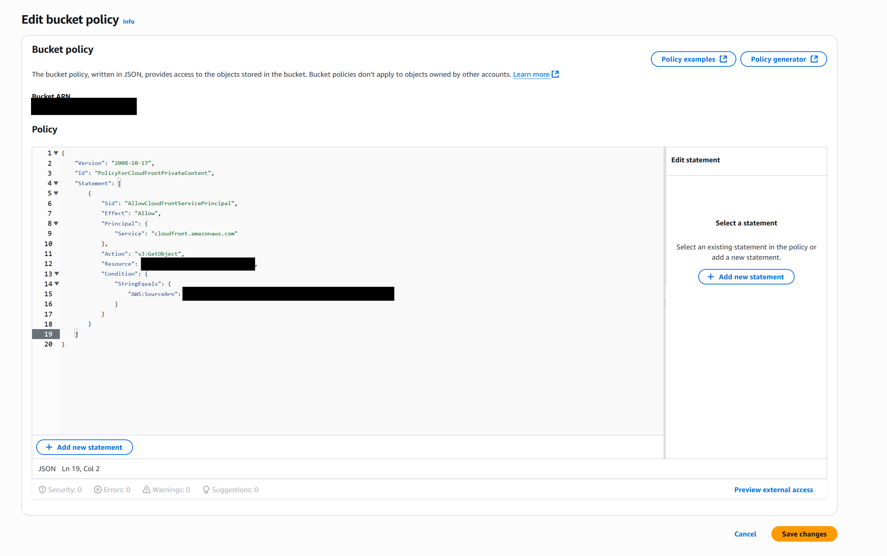
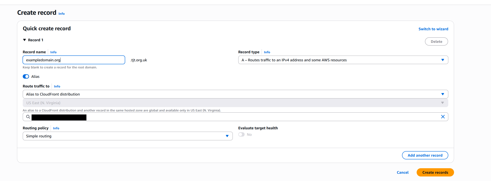
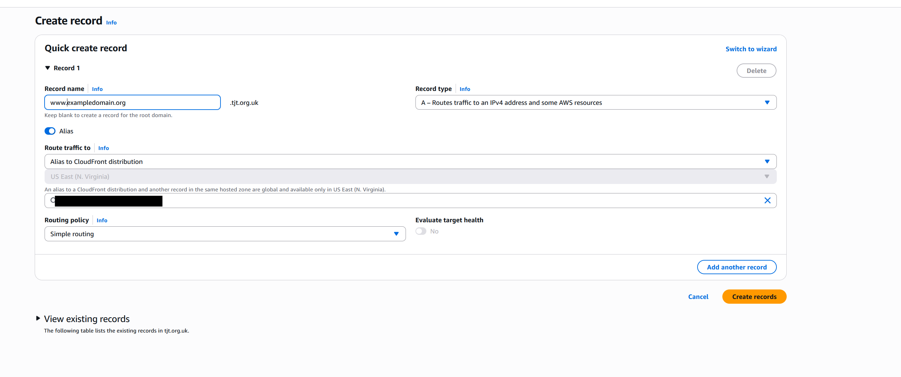

## Phase 1: Register A Domain
1. Register a domain
  - Go to the Route 53 console 
  - Regiser a domain.
  - Search to check availability for your domain 
  - Proceed to the checkout.
  - Confirm your contact information.
  - Review and submit. 

## Phase 2: Store Your Website on Amazon S3
2. Create an S3 Bucket: 		
  - Go to the S3 service in the AWS Management Console.
  - Select "Create bucket". 
  - Bucket name: Choose a globally unique name. For CloudFront/Route 53, it's often best practice for the bucket name to match your custom domain (i.e. www.yourdomain.com or yourdomain.com). 
  - AWS Region: Choose the region most suitable for your project or where most of your users might be (e.g. eu-west-2 London).
  - Object Ownership: "ACLs disabled" (recommended).
  - Block Public Access settings for this bucket (Recommended for CloudFront OAC). Access is controlled via CloudFront.
  - Leave other settings as default for now.
  - Optionally you can add a tag to make it easier to find all project pieces.
  - Select "Create bucket".
  - Select your newly created bucket.
  - Select upload.
  - Upload your index.html file. 

## Phase 3: Secure The Website With ACM
3. Request a certificate for SSL/TLS encryption. 
  - In order for you to create a certificate you need to move over to the us-east-1 region.
  - Select request a certificate.
  - Select public certificate. 
  - Enter your domain name 
  - Also add additonal names that link to your domain i.e. www.exampledomain.org, exampledomain.org 
  - Select DNS validation.
  - Select create.
  - After requesting the certificate status will be "pending validation".
  - Select your certificate request.
  - For each domain create records in Route 53.
    * This creates the necessary CNAME records in the Route 53 hosted zone.
   - Once the validation status is complete, status will change to 'issued'. 

## Phase 4: Create A CloudFront Distribution
4. Create a CloudFront distribution to share the content securely.
  - Go to the CloudFront service on the AWS console. 
  - Select create a distribution.
  - Enter your distribution name. 
  - Enter your custom domain.
    * Add additional domain names i.e. www.exampledomain.org
  - Select next. 
  - Specify the orign (S3).
  - Start typing your S3 bucket name or you can select the "browse S3" button.
  - Grant CloudFront Permission to access your origin.
  - Use recommended settings. 
    *These are the default recommended settings AWS provides.* 
    * CreateiCCompress objects automatically – Yes
    * Viewer protocol policy – Redirect to HTTPS
    * Allowed HTTP method – GET, HEAD
    * Restrict viewer access – No
    * Cache policy – CachingOptimized
    * Origin request policy – None
    * Response header policy – None
    * Smooth Streaming – No
    * Field level encryption – No
    * Enable real-time logs – No
    * Functions – No
    * Use recommended origin settings.
  - Proceed without WAF.
  - Select the certificate you created earlier.
  - Select next.
  - Review all the information is correct then select create distribution.
  - Once created select your distribution.
  - Select edit settings.
  - In the 'Default root object - optional' section select index.html.
  - Save and exit.
  - Select behaviours.
  - Edit the default behaviours.
  - Change the viewer protocol policy to "redirect http to https". [Change Behaviours](screenshots/visual-guides/4.distribution-behaviours.png) 
  - Save changes and exit.
  - Next select origins.
  - Copy the bucket policy. [CloudFront Generated Policy](screenshots/visual-guides/4.copy-bucket-policy.png)
  - Return to the S3 portal.

## Phase 5: Enter Bucket Policy
5. Setting the bucket policy to allow CloudFront access
  - Open your website bucket.
  - Select permissions. 
  - Select edit on the bucket policy.
  - Paste the bucket policy in the policy window.
    
## Phase 6: Map Your Custom Domain
6. Map your custom domain by directing Route 53 to your CloudFront distribution.
  - Go to the Route 53 console.
  - Select your hosted zone.
  - Create an A record for the first domain.
    * Select create record.
    * Name the record the same as your domain i.e. "exampledomain.org" 
    * Select the 'Alias' button.
    * In endpoint chose 'Alias' to CloudFront distribution'.
    * In distribtuion chose your distribution.
    * Select create records.
  - Create an A record for the second domain.
    * Select create record.
    * Name the record the same as your domain i.e. "www.exampledomain.org" 
    * Select the 'Alias' button.
    * In endpoint chose 'Alias' to CloudFront distribution'.
    * In distribtuion chose your distribution.
    * Select create records.

## Phase 7: Test Your Website
7. Testing the website to see if it is accessible.
  - Try connecting to your website using the domain in your browser.
  - Check for the padlock in the corner to ensure that the device is using HTTPS.
  
